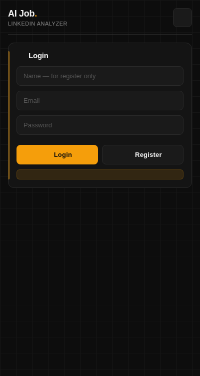
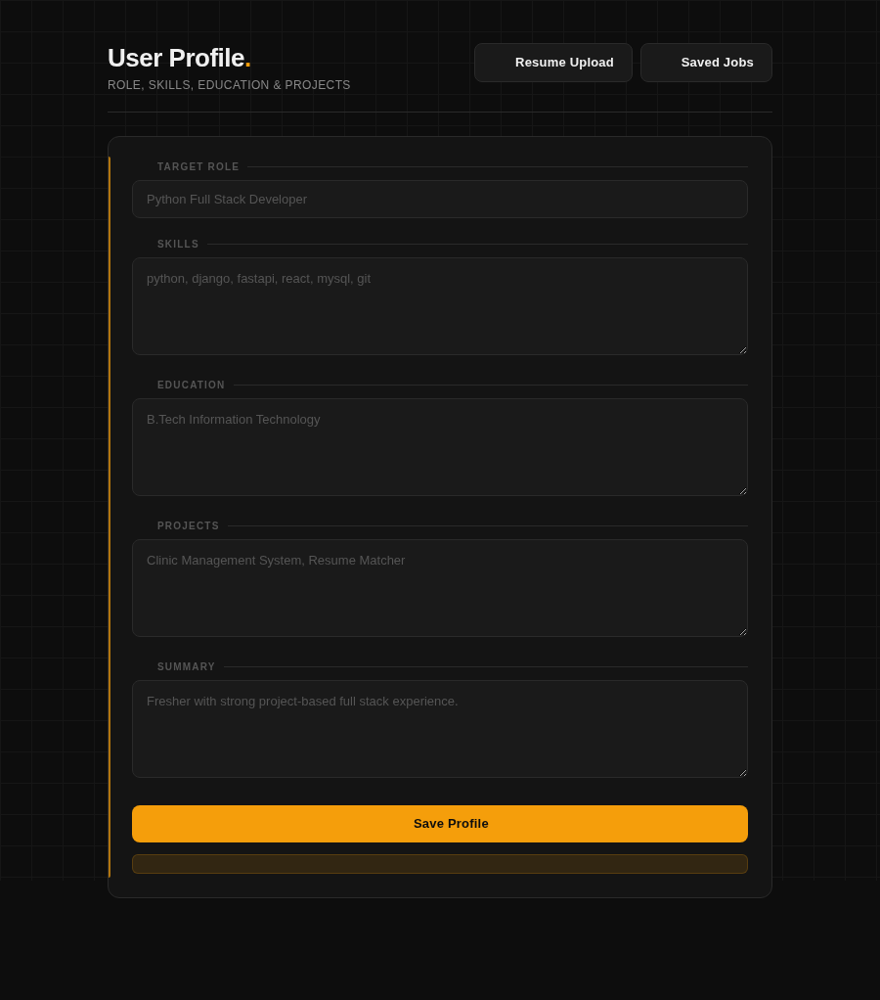
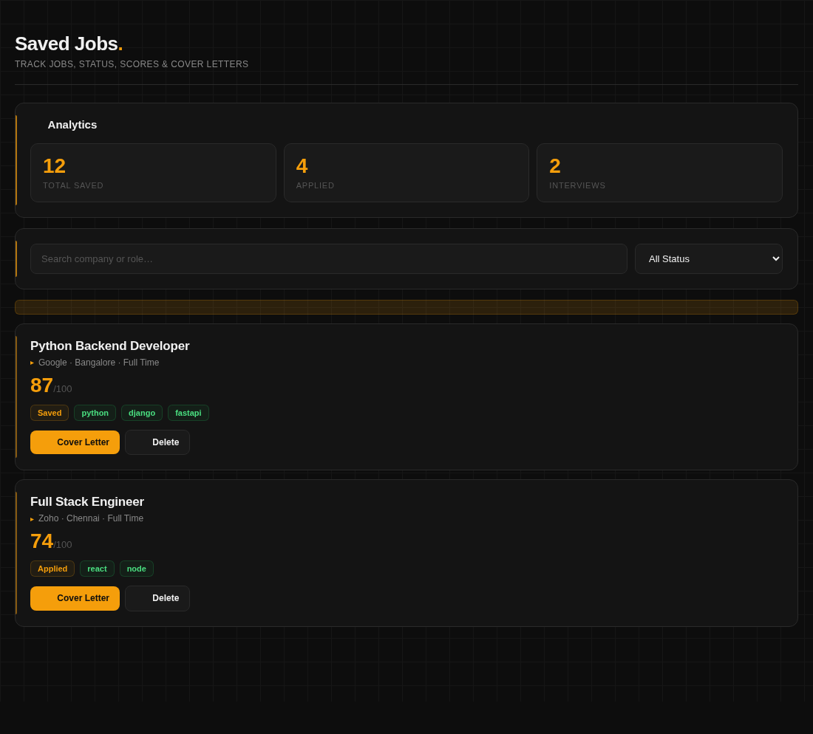
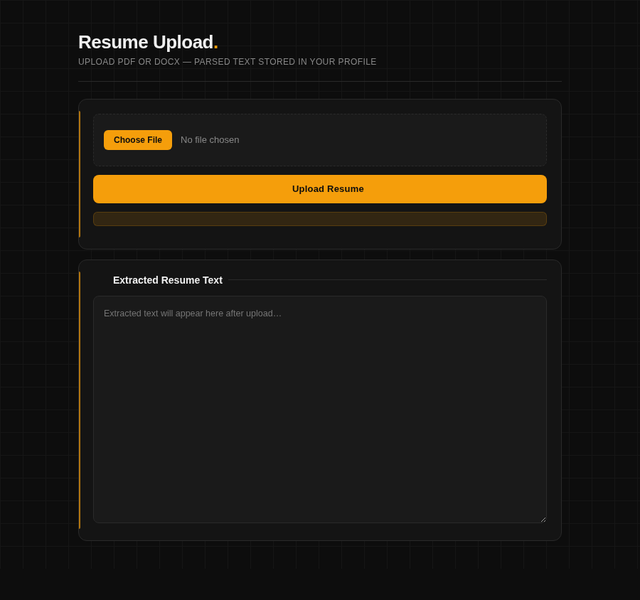
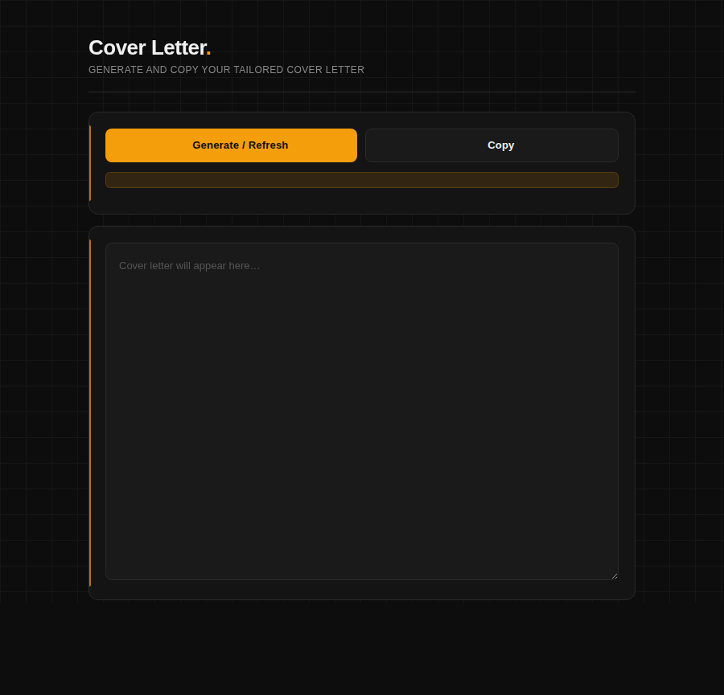

#  AI Job Assistant

An AI-powered browser extension that helps job seekers analyze LinkedIn job postings and apply smarter using NLP.


##  Overview

AI Job Assistant is a full-stack application + Firefox extension that extracts job descriptions from LinkedIn and provides intelligent insights such as:

- Match score
- Missing skills
- Keyword suggestions
- Resume analysis
- Cover letter generation
- Job tracking


##  Features

- Analyze LinkedIn jobs in real-time  
- Match score based on user skills/resume  
- Identify missing skills  
- Suggest resume keywords  
- Generate personalized cover letters  
- Save and track job applications  
- Upload and analyze resumes  


##  Tech Stack

### Frontend (Extension)
- JavaScript
- HTML/CSS
- Firefox Extension APIs

### Backend
- FastAPI (Python)
- REST APIs

### NLP
- spaCy (text processing)
- scikit-learn (TF-IDF + cosine similarity)

### Database
- SQLite (can be upgraded to PostgreSQL)

### Deployment
- Render (Backend hosting)


##  Project Structure

```bash
Job-Assistant-AI/
│
├── job-assistant-api/ # Backend (FastAPI)
│ ├── app/
│ ├── services/
│ ├── models/
│ ├── schemas/
│ └── main.py
│
├── job-assistant-extension/ # Firefox Extension
│ ├── manifest.json
│ ├── background.js
│ ├── content.js
│ ├── popup/
│ ├── options/
│ ├── saved/
│ ├── resume/
│ ├── cover-letter/
│ └── icons/
│
├── privacy-policy.md
└── README.md
```


##  How It Works

1. User opens a LinkedIn job page
2. Extension extracts job description
3. Data is sent to backend API
4. NLP pipeline processes:
   - text cleaning
   - skill extraction
   - similarity scoring
5. Response includes:
   - match score
   - missing skills
   - suggestions
6. Results shown in extension popup


##  API Endpoints

- `POST /analyze-job` → Analyze job description
- `POST /save-job` → Save job details
- `POST /generate-cover-letter` → Generate cover letter
- `POST /upload-resume` → Resume analysis
- `GET /saved-jobs` → Get saved jobs


##  Installation

### 1. Clone Repository
```bash
git clone https://github.com/manikandan-mk007/Job-Assistant-AI.git
cd Job-Assistant-AI
```

### 2. Backend Setup
```bash
cd job-assistant-api

python -m venv venv
venv\Scripts\activate   # Windows

pip install -r requirements.txt

uvicorn app.main:app --reload
```

### 3. Extension Setup

1. Open Firefox
2. Go to: `about:debugging`
3. Click This Firefox
4. Click Load Temporary Add-on
5. Select `manifest.json` from `job-assistant-extension`


##  Live Backend

```bash
https://job-assistant-ai-t1no.onrender.com
```

##  Screenshots


| Section       |  Extension Image|
|--------------|------------|
| SignUp/SignIn|  |
| Form Options |  |
| Saved Job    |  |
| Resume Extraction   |  |
| Cover Letter     |  | 


##  Privacy Policy

`https://github.com/manikandan-mk007/Job-Assistant-AI/blob/main/privacy-policy.md`

##  Future Improvements

- Chrome extension support
- Job alerts system
- AI-based interview preparation
- Advanced resume parsing
- Analytics dashboard


##  Author

- Thangamanikandan I
- Python Full Stack Developer(Fresher)


##  Contact

Email: thangamanikandan.it@gmail.com
